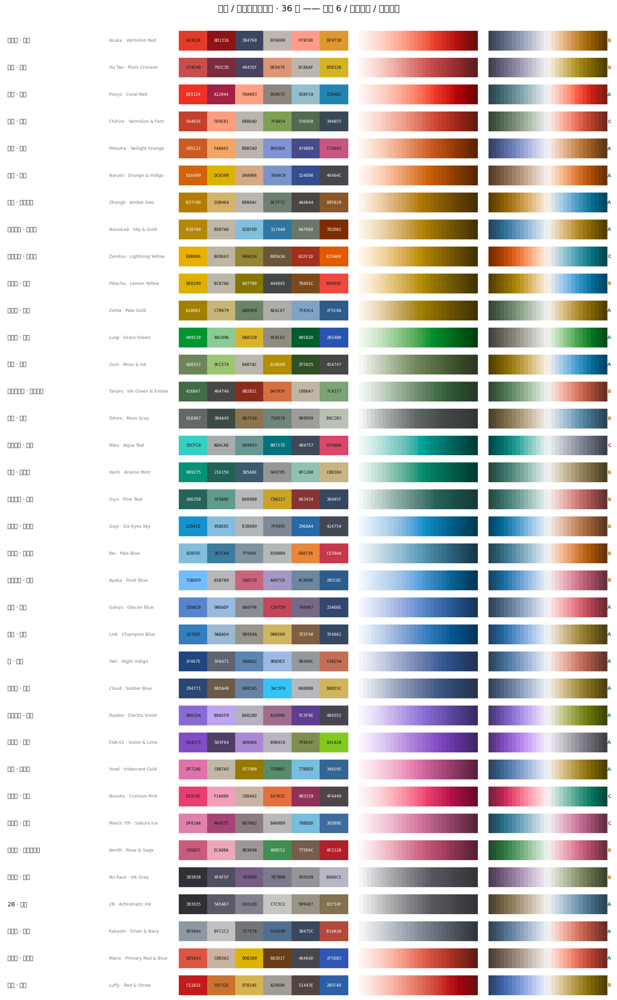
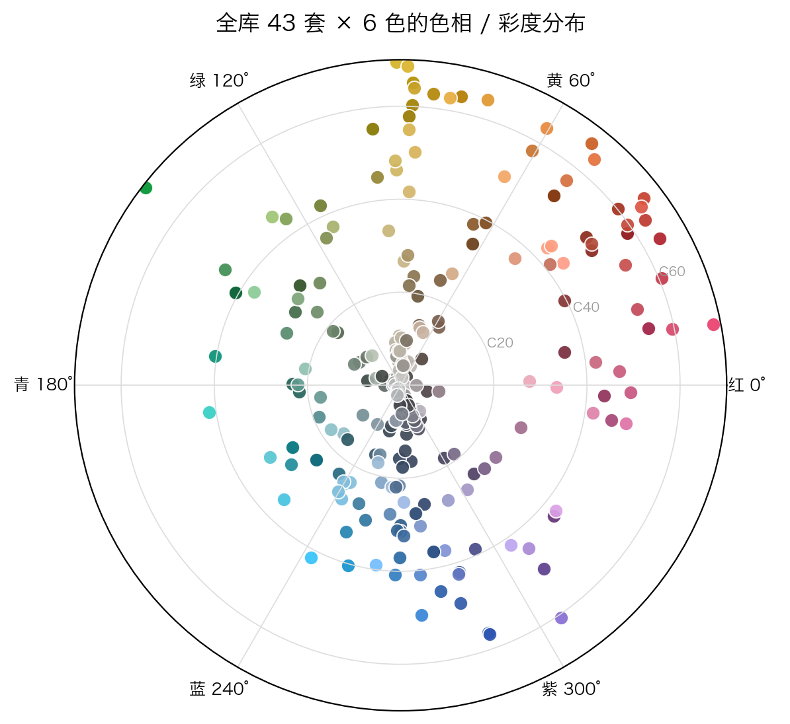
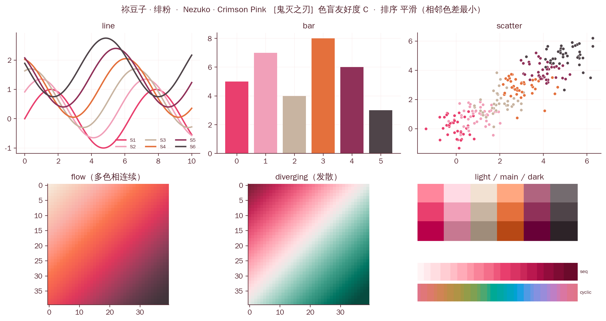
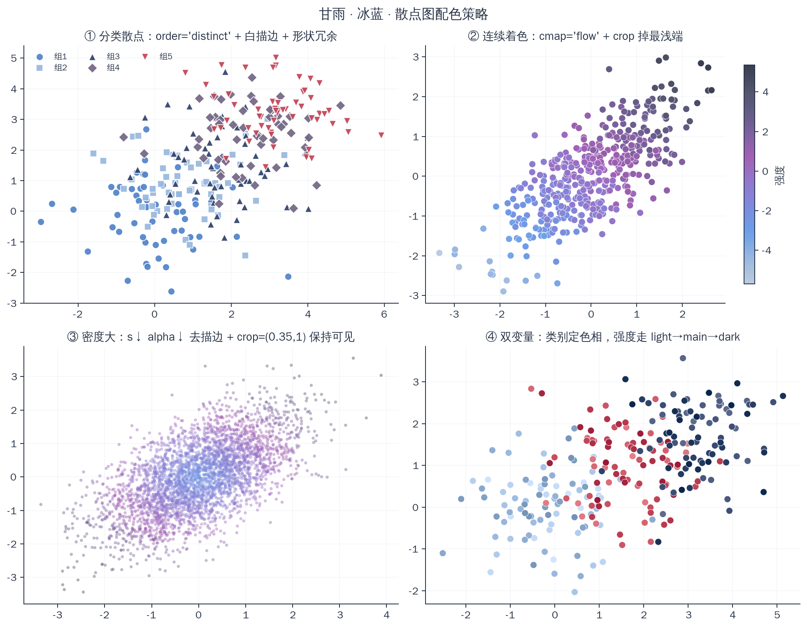

<div align="center">

# 动漫 / 游戏角色配色库

**36 套取自动漫与游戏角色的配色，为科研配图与 PPT 做过色彩学调优**

[](https://github.com/zomosky/anime-palettes/actions/workflows/ci.yml)
[](LICENSE)
[](https://www.python.org)
[](docs/INSTALL.md)
[](docs/INSTALL.md#uv)

每套 = **6 主色** + 深/浅变体 + 4 条连续色标 + 配套中性色 + 色环 · 预置 **4 种排列顺序** · 标注**色盲友好度**
交付形式：交互色卡库 HTML · Python 模块 · Excel · PPT 取色板与主题色 · Adobe `.ase` · GIMP `.gpl` · Origin 清单



</div>

---

## 这是什么

给图表配色时常见的两难：调色板网站上的配色好看但没有语义、区分度也没人验证过；
科研标准配色（viridis、ColorBrewer）安全但千篇一律。

这个库从 36 个动漫 / 游戏角色的视觉印象取色，然后**用色彩学手段把它们改造得能真的用在图表上**：
锁死每个颜色的色相角保住角色辨识度，只在 CIELAB 里调明度和彩度，
用坐标下降最大化「正常视觉 + 红/绿色盲模拟」下的最小 ΔE2000，
再约束白底对比度。每套配色的区分度、色盲友好度、色标的明度单调性与感知均匀度都有实测数值，
不达标的会**如实标出来**而不是粉饰过去。

命名带一眼可识别的色调标签 —— `胡桃 · 绯梅`、`甘雨 · 冰蓝`、`龙猫 · 苔灰`、`初号机 · 紫萤`、`2B · 素墨` ——
翻色卡时不用先想起角色长什么样。

<table>
<tr>
<td width="50%"><br><sub><b>色环</b>：角度 = CIELAB 色相，半径 = 彩度。一眼看出色库覆盖了色轮的哪几块</sub></td>
<td width="50%"><br><sub><b>六联示意图</b>：折线 / 柱状 / 散点 / 连续色标 / 发散色标 / 深浅变体</sub></td>
</tr>
</table>

---

## 快速开始

### 只想拿颜色 → 打开色卡库

下载 [`dist/anime-palettes.html`](dist/anime-palettes.html)，**双击用浏览器打开**，单文件、无需联网。

- 按色系 / 色盲等级筛选，搜角色、色调或作品名
- 点色块复制 HEX；点底部色标条弹出代码面板 —— Python / R / MATLAB / Origin / CSS 七种格式，可复制或下载成文件
- 一键切 4 种排列顺序、模拟红/绿/蓝色盲与灰度、显示深浅变体
- 每张卡带色环和迷你图表预览，切换时同步更新

### 要在 Python 里用

```bash
pip install git+https://github.com/zomosky/anime-palettes.git          # pip
uv add "anime-palettes @ git+https://github.com/zomosky/anime-palettes.git"   # uv
```

没有 uv？`curl -LsSf https://astral.sh/uv/install.sh | sh`（Windows 用
`irm https://astral.sh/uv/install.ps1 | iex`，有 pip 的话 `pip install uv` 也行）。
**完整安装矩阵见 [`docs/INSTALL.md`](docs/INSTALL.md)** —— 覆盖 pip / uv / conda /
离线内网 / 国内网络慢 / 其他语言读 JSON，以及每一种的钉版本写法。

```python
import anime_palettes as ap
import matplotlib.pyplot as plt

ap.use_cjk_font()                      # 中文标签正常显示
ap.use("hutao", order="distinct")      # 接管颜色循环 + 坐标轴 + 网格 + 默认 colormap

fig, ax = plt.subplots()
for i in range(4):
    ax.plot(x, y[i], label=f"组 {i+1}")
ax.legend()
```

散点用连续变量着色 —— 用 `flow` 色标（多色相 + 明度严格单调）：

```python
ax.scatter(x, y, c=v, s=42, edgecolor="white", linewidth=.35,
           cmap=ap.cmap("ganyu", "flow", crop=(.10, .93)))
```

`examples/quickstart.py` 是可直接跑的完整例子。

### 一点都不想装

三条路，都不碰 Python 环境：

```bash
# ① 单文件模块（~130 KB，核心 API 零依赖，配色数据就在里面）
curl -fsSLO https://raw.githubusercontent.com/zomosky/anime-palettes/main/anime_palettes.py

# ② PEP 723 单文件脚本 —— 依赖写在脚本注释里，uv 自动建环境
uv run examples/uv_single_file.py

# ③ 只用命令行，跑完不留痕迹
uvx --from git+https://github.com/zomosky/anime-palettes anime-palettes show 胡桃
```

或者直接读 `dist/anime_palettes.json` 的 raw 链接 —— R、MATLAB、JS 都能用，
写法见 [`docs/INSTALL.md`](docs/INSTALL.md#其他语言直接读-json)。

### 命令行

装完会多一个 `anime-palettes` 命令（没装也能 `python anime_palettes.py <命令>`）：

```bash
anime-palettes ls --family 蓝 --grade A     # 终端里直接显示色块
anime-palettes show 胡桃                    # 单套全貌
anime-palettes hex 甘雨 --safe              # 色盲安全子集，方便管道
anime-palettes code ganyu --ramp flow --lang r > ganyu_flow.R
```

`--lang` 支持 `python` / `python256` / `r` / `matlab` / `origin` / `css` / `hex`。

### 要在 PPT 里用

打开 [`dist/anime-palettes-picker.pptx`](dist/anime-palettes-picker.pptx)，用取色器直接吸色 ——
每页一套配色，色块上印着 HEX，页内还有用这套色渲染的原生柱状图和折线图。
想整份幻灯片换色，把 `dist/ppt-theme-colors/*.xml` 放进 PowerPoint 的 `Theme Colors` 文件夹。

---

## 收录的 36 套

| 色系 | 配色 |
|---|---|
| **红** | 明日香·朱赤　胡桃·绯梅　波妞·珊瑚　千寻·朱绿 |
| **橙** | 三叶·暮橙　鸣人·橙靛　钟离·琥珀岩金　娜乌西卡·天青金 |
| **黄** | 我妻善逸·雷明黄　皮卡丘·柠黄　塞尔达·淡金 |
| **绿** | 路易吉·草绿　索隆·苔墨　灶门炭治郎·墨绿炭赤　龙猫·苔灰 |
| **青** | 初音未来·青碧　温迪·风薄荷　富冈义勇·松青 |
| **蓝** | 五条悟·晴空蓝　绫波丽·苍白蓝　神里绫华·霜蓝　甘雨·冰蓝　林克·苍蓝　泷·夜靛　克劳德·军蓝 |
| **紫** | 雷电将军·雷紫　初号机·紫萤　哈尔·金蓝虹 |
| **粉** | 祢豆子·绯粉　三月七·樱冰　爱丽丝·玫粉鼠尾草 |
| **中性** | 无脸男·墨灰　2B·素墨　卡卡西·银藏 |
| **撞色** | 马力欧·正红蓝　路飞·赤麦 |

---

## 每套配色包含什么

| 部件 | 数量 | 用途 |
|---|---|---|
| `colors` 主色 | 6 | 分类着色。默认「平滑」排列，画多系列图时切「区分度优先」 |
| `light` / `dark` | 6 + 6 | L\* ±16 的浅/深变体：误差带、置信区间、强调、深色底 |
| `bg` / `bg2` / `muted` / `ink` | 4 | 纸色、次级底、辅助灰、墨色 —— 整张图的中性骨架 |
| `seq` 连续色标 | 256 | 单色相、明度单调：热图、密度图、等高线 |
| **`flow` 强过渡色标** | 256 | **多色相 + 明度严格单调：散点连续着色、需要强过渡的图** |
| `div` 发散色标 | 256 | 中点近白：相关系数、差值、以 0 为中心的量 |
| `cyclic` 环形色标 | 256 | 首尾闭合、明度恒定：相位、角度、风向、一天中的时刻 |

四种排列顺序：**平滑**（相邻 ΔE2000 之和最小，过渡最顺）、**区分度优先**（前几色差异最大，多系列图用）、
**色相环**、**明度浅→深**。同一套色换个排法观感差别很大，色卡库里可以直接对比。

---

## 散点图与强过渡场景



散点和折线、柱状不一样：点小、面积碎，还常常要用颜色编码第三个连续变量。
6 个离散主色中间没有过渡，直接拿去做连续着色是不成立的 —— 这就是 `flow` 存在的理由。

| 场景 | 做法 |
|---|---|
| 分类散点 | `order="distinct"` + 白描边 + 换 marker 形状（灰度和色盲下的冗余） |
| 连续变量着色 | `cmap(name, "flow", crop=(.10, .93))` —— crop 掉最浅端，否则小点在白底上看不见 |
| 点特别多 | 缩点径、降 alpha、去描边，`crop=(.35, 1)` 只留深的一半（alpha 叠加会整体提亮） |
| 双变量 | 类别定色相，强度走该色的 `light → main → dark` |
| 相位 / 角度 / 时刻 | `cyclic`，且 `vmin=0, vmax=2π` |
| 需要灰度打印 | `seq` 或 `flow`（都明度单调）；别用 `div`、`cyclic` |

一句话判断：**颜色要表达「多少」就必须明度单调**（`seq` / `flow`），要表达「哪一类」才用离散主色。
`ap.ramp_info(name, "flow")` 里的 `monotonic` 字段就是这个检查。
完整说明见 [`docs/USAGE.md`](docs/USAGE.md)。

---

## 色盲友好度

不强行把所有配色都改成色盲安全 —— 那会把角色配色改得面目全非。
取而代之的是**如实标级 + 给出安全子集**：

| 等级 | 数量 | 含义 | 用法 |
|---|---|---|---|
| **A** | 18 | 红/绿色盲模拟下 6 色两两 ΔE2000 ≥ 13 | 整套随便用，多系列图首选 |
| **B** | 13 | 大部分可分 | 4 个系列以内，或按安全子集取 |
| **C** | 5 | 角色本身就是同色系 | 多系列时只用 `ap.safe()` 给出的子集 |

色卡库里可以直接切到红/绿/蓝色盲和灰度模拟，色块右上角有小圆点的就是会撞的那几个。

---

## Python API 速查

```python
ap.ls(family="蓝", grade="A")          # 列出 / 筛选
ap.find("原神")                        # 按角色、色调、作品模糊搜

ap.colors("miku")                      # 6 主色（默认平滑序）
ap.colors("miku", n=3, order="distinct", variant="dark")
ap.safe("nezuko")                      # 色盲下仍可分的子集
ap.neutrals("gojo")                    # bg / bg2 / muted / ink

ap.use("miku", order="distinct")       # 全局套用
with ap.using("hutao"): ...            # 临时套用

ap.cmap("ganyu", "flow", crop=(.1,.93))  # seq / flow / div / cyclic，加 _r 反向
ap.register()                          # 注册全部，之后可用字符串 cmap="ganyu_flow"
ap.ramp_info("ganyu", "flow")          # 明度跨度 / 是否单调 / 感知均匀度

ap.preview("eva01")                    # 六联示意图
ap.wheel("eva01");  ap.wheel_all()     # 色环
ap.scatter_guide("eva01")              # 散点四策略对照
```

名字很宽松：`"miku"` `"初音未来"` `"miku-aqua"` `"青碧"` `"Miku"` 都指同一套。

---

## 仓库结构

```
anime_palettes.py          可直接 import 的模块（零依赖，matplotlib 懒加载）
dist/                      全部交付物
  anime-palettes.html        单文件交互色卡库
  anime-palettes-picker.pptx PPT 取色板（37 页，含原生图表示例）
  anime_palettes.xlsx        六表：色卡总览 / 逐色明细 / 深浅延伸 / 排序方案 / 色标采样 / 使用说明
  anime_palettes.{csv,json}  纯数据（json 含 256 级色标，供二次开发）
  ase/ gpl/                  Adobe 与 GIMP 色板
  ppt-theme-colors/          PowerPoint 主题色 XML
  origin-hex/                Origin / GraphPad 逐行粘贴用清单
src/                       生成链路（改 data.py → make all）
docs/INSTALL.md            安装矩阵：pip / uv / conda / 离线 / 其他语言
docs/USAGE.md              详细使用说明
examples/quickstart.py     可直接跑的例子
examples/uv_single_file.py PEP 723 单文件脚本，uv run 一句话搞定
tests/test_palettes.py     365 项自检，含 CIEDE2000 实现的标准数据验证
```

## 自己改 / 重新生成

想加角色：在 `src/data.py` 里加一条 6 色记录，然后

```bash
make tune     # 科研可用性微调（约 40s，结果固化进 src/tuned.py）
make all      # 派生 + 生成全部交付物 + 跑测试
```

依赖：Python 3.8+、`matplotlib` `numpy` `openpyxl`（生成用），`node` + `pptxgenjs`（只为 PPT 取色板）。
用 uv 的话 `uv sync --extra build` 一步到位。

---

## English

36 colour palettes derived from anime and game characters, engineered for scientific figures and slide decks.
Each palette ships 6 categorical colours, light/dark variants, four continuous colormaps
(single-hue sequential, **multi-hue `flow` with strictly monotonic lightness** for scatter plots,
diverging, and cyclic), neutral tokens, and four preset orderings.

Colours keep each character's CIELAB **hue angle locked** for recognisability; only lightness and chroma are
tuned, by coordinate descent maximising the minimum CIEDE2000 distance under both normal vision and
simulated protanopia/deuteranopia (Machado et al. 2009 matrices), subject to white-background contrast bounds.
Every palette reports measured separability, colour-vision-deficiency grade (A/B/C) and a
CVD-safe subset — shortfalls are labelled rather than hidden.

Ships as a zero-dependency Python module, a single-file interactive HTML swatch browser
(click a colormap bar to get ready-to-paste Python / R / MATLAB / Origin / CSS code),
Excel workbook, PowerPoint picker deck and theme-colour files, Adobe `.ase`, GIMP `.gpl`, and Origin lists.

```bash
pip install git+https://github.com/zomosky/anime-palettes.git
uv add   "anime-palettes @ git+https://github.com/zomosky/anime-palettes.git"
uvx --from git+https://github.com/zomosky/anime-palettes anime-palettes ls
```

```python
import anime_palettes as ap
ap.use("ganyu", order="distinct")
ax.scatter(x, y, c=v, cmap=ap.cmap("ganyu", "flow", crop=(.1, .93)))
```

Zero-dependency single file — `curl` it into your project and import, no install needed.
Full install matrix (pip / uv / conda / offline / other languages) in
[`docs/INSTALL.md`](docs/INSTALL.md).

---

## 许可

代码与配色数据以 [MIT](LICENSE) 发布，随便用。

配色为**基于角色视觉印象重新推导的原创色值**，不含任何原作素材、图像或商标。
角色与作品名称仅用作色板标识（nominative use）。相关角色与作品的权利归各自版权方所有，
本项目与其没有任何关联、也未获得其背书。
